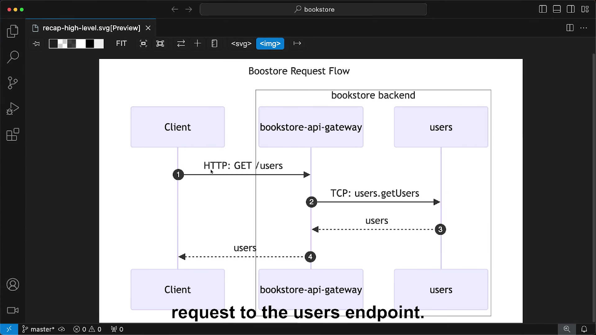

## CONVERT MONOREPO

```sh
nest generate app gateway
nest generate app users
nest generate app books
```

> REMOVE INITIAL APP AND UPDATE NEST CLI  
> REPLACE WITH GATEWAY

```sh
nest starts gateway --watch
nest start users --watch
```

## CONVERTING TO MICROSERVICE

```sh
npm install @nestjs/microservices
```

> NEST FACTORY CREATE MICROSERVICE METHOD INSTEAD OF NEST FACTORY CREATE

## SERVICES

```sh
IN HTTP SERVERS CONTROLLER IS RESPONSIBLE FOR HANDLING HTTP REQUST AND RETURINIG RESPONSE
BUT IN MICROSERVICES CONTROLLER IS RESPONSIBLE FOR HANDLING MESSAGES AND EVENTS
```

```ts
import { NestFactory } from '@nestjs/core';
import { MicroserviceOptions, Transport } from '@nestjs/microservices';
import { UsersModule } from './users.module';

async function bootstrap() {
  const app = await NestFactory.createMicroservice<MicroserviceOptions>(
    UsersModule,
    {
      transport: Transport.TCP,
      options: {
        port: 3001,
      },
    },
  );
  await app.listen();
}
bootstrap();
```

```sh
import { Controller } from '@nestjs/common';
import { MessagePattern } from '@nestjs/microservices';

import { UsersService } from './users.service';

@Controller()
export class UsersController {
  constructor(private readonly usersService: UsersService) { }

  @MessagePattern("users.findAll")
  getHello() {
    return this.usersService.findAll();
  }
}
```

```sh
nest generate resource books --project books
```

## GATEWAY

```sh
nest generate module users --project gateway
nest generate service users --project gateway
nest generate controller users --project gateway
```

```ts
import { Module } from '@nestjs/common';
import { ClientsModule, Transport } from '@nestjs/microservices';

import { UsersService } from './users.service';
import { UsersController } from './users.controller';

@Module({
  imports: [
    ClientsModule.register([
      {
        name: 'USERS_CLIENT',
        transport: Transport.TCP,
        options: { port: 3001 },
      },
    ]),
  ],
  providers: [UsersService],
  controllers: [UsersController],
})
export class UsersModule {}
```

```ts
import { Inject, Injectable } from '@nestjs/common';
import { ClientProxy } from '@nestjs/microservices';

@Injectable()
export class UsersService {
  constructor(@Inject('USERS_CLIENT') private usersClient: ClientProxy) {}

  findAll() {
    return this.usersClient.send('users.findAll', {});
  }
}
```

## ORGANIZING CODE

```sh
EACH MICROSERVICE WILL DEFINE WHAT MESSAGES IT CAN HANDLE
AND WHAT PAYLOAD IT EXPECTS
AND WHAT DATA IT RETURNS

THOSE CONTRACTS WILL BE ADDED IN THE SHARED LIBRARY THAT IS USED BY THE MICROSERVICES APPLICATION
AND THE GATEWAY
GATEWAY DTO WILL STAY AS THEY ARE
BECAUSE THERE IS NO NEED TO SHARE THEM, THEY ARE ONLY USED INSIDE GAEWAY
```

```sh
nest generate library contracts

rm -rf libs/contracts/src/*
mkdir libs/contracts/src/books
cp apps/books/src/books/dto/* libs/contracts/src/books
```

- [ ] Handle Port and Configuration of Modules
